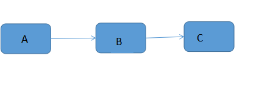

# spring cloud study
本次学习基于spring cloud Greenwich SR1 版本

## 学习要点: 

Spring Boot/Spring Cloud应用开发套路
* 加依赖
* 加注解
* 写配置

## Eureka (服务注册与发现)

Eureka是Netflix开源的服务发现组件，本身是一个基于REST的服务，包含Server和Client两部分，Spring Cloud将它集成在子项目Spring Cloud Netflix中

### Eureka Server (快速入门)
遵循开发套路

* 添加依赖
```xml
<dependencies>
    <dependency>
        <groupId>org.springframework.cloud</groupId>
        <artifactId>spring-cloud-starter-netflix-eureka-server</artifactId>
    </dependency>
</dependencies>

```
* 添加注解 @EnableEurekaServer
```java
@SpringBootApplication
@EnableEurekaServer 
public class EurekaApplication {

    public static void main(String[] args) {
        SpringApplication.run(EurekaApplication.class, args);
    }
}
```
```yml
server:
  port: 8001

spring:
  application:
    name: microservice-discovery-eureka

eureka:
  client:
    service-url:
      #erueka server的地址，记住/eureka不要掉了
      defaultZone: http://localhost:8001/eureka
    # 是否从eureka server注册，这里我们选择false
    fetch-registry: false
    # 是否从eureka server 中拉取服务
    register-with-eureka: false
```

启动项目,访问http://localhost:8001/


### Eureka Client 

```xml
<dependency>
    <groupId>org.springframework.cloud</groupId>
    <artifactId>spring-cloud-starter-netflix-eureka-client</artifactId>
</dependency>
``` 

```java
@SpringBootApplication
@EnableDiscoveryClient
public class ProvideApplication {

    public static void main(String[] args) {
        SpringApplication.run(ProvideApplication.class, args);
    }
}
```
在Greenwich SR1版本中可以省略@EnableEurekaClient和@EnableDiscoveryClient注解，但为了养成好习惯，建议加上相应注解

    @EnableDiscoveryClient: 可以配合不同的服务发现server 使用
    @EnableEurekaClient: 只能配合 Eureka server 使用

```yml
server:
  port: 9001
spring:
  application:
    name: microservice-provide-user
  datasource:
    driverClassName: com.mysql.jdbc.Driver
    url: jdbc:mysql://localhost:3306/cloud-study?useUnicode=true&characterEncoding=UTF-8&autoReconnect=true&useSSL=false&allowMultiQueries=true
    username: root
    password: root
    jpa:
      hibernate:
        ddl-auto: update
      show-sql: true


eureka:
  client:
    service-url:
      defaultZone: http://localhost:8001/eureka/
  instance:
   # 是否显示ip,如果不设置那么就会显示主机名，默认false
    prefer-ip-address: true
```
启动项目，可以发现项目已经被注册进eureka

 

 完整代码：

 [microservice-discovery-eureka](https://github.com/AmberBar/spring-cloud-study/tree/master/GreenwichSR1/microservice-discovery-eureka)

 [microservice-provide-user](https://github.com/AmberBar/spring-cloud-study/tree/master/GreenwichSR1/microservice-provide-user)

 ### eureka 深入

Eureka包含两个组件：Eureka Server 和 Eureka Client:

* Eureka Server负责提供服务发现的能力，各个微服务启动时，会向Eureka Server注册自己的信息（例如IP、端口、微服务名称等）
* Eureka Client是一个Java客户端，可以与EurekaServer交互
* client启动后，会周期性的像server发送心跳，默认情况下 `30s`,如果server在一定时间内没有收到client的心跳，那么server会注销实例`90s`
* Eureka Server遵循CAP原则，符合AP。eureka集群中每个节点之间都是平等状态。如果一个节点宕机，不会进行选举。因此可以很有效的保证可用性

#### 搭建erueka集群
在host中添加 
127.0.0.1 peer1 peer2
可以再`microservice-discovery-eureka` 的基础上修改`application.yml`

```yml
spring:
  application:
    name: microservice-discovery-eureka-cluster
eureka:
  client:
    serviceUrl:
      defaultZone: http://peer2:8002/eureka/,http://peer1:8003/eureka/
---
spring:
  profiles: peer1
server:
  port: 8002
eureka:
  instance:
    hostname: peer1
---
spring:
  profiles: peer2
server:
  port: 8003
eureka:
  instance:
    hostname: peer2
```
修改`microservice-provide-user`的`application.yml`
```yml
server:
  port: 9002
spring:
  application:
    name: microservice-provide-user
  datasource:
    driverClassName: com.mysql.jdbc.Driver
    url: jdbc:mysql://localhost:3306/cloud-study?useUnicode=true&characterEncoding=UTF-8&autoReconnect=true&useSSL=false&allowMultiQueries=true
    username: root
    password: root
    jpa:
      show-sql: true
eureka:
  client:
    service-url:
      defaultZone: http://peer1:8002/eureka/,http://peer2:8003/eureka/
  instance:
    prefer-ip-address: true

```

启动服务
 

## Ribbon 负载均衡器

Ribbon是Netflix提供的负载均衡器, 只需要为Ribbon提供服务提供者地址，Ribbon就会根据一定的算法调用相应服务，从而达到负载均衡，比如 随机，轮询等。

Spring Cloud Ribbon 是基于Netflix Ribbn实现的一套客户端负载均衡的工具。客户端我的理解是，把选择压力放在了客户端，比如现实生活中的排队点餐

创建微服务 `microservice-consumer-ribbon`

### Quick Start

* 添加依赖
因为`spring-cloud-starter-netflix-eureka-client`依赖已经包含了ribbon，因此这里只需要引入`spring-cloud-starter-netflix-eureka-client`
```xml
<dependency>
    <groupId>org.springframework.cloud</groupId>
    <artifactId>spring-cloud-starter-netflix-eureka-client</artifactId>
</dependency>
```
* 写注解

`RibbonApplication.java`
```java
@SpringBootApplication
@EnableDiscoveryClient
public class RibbonApplication {

    public static void main(String[] args) {
        SpringApplication.run(RibbonApplication.class, args);
    }
}

```

* 写配置
配置主要是把ribbon注册进eureka server中
```yml
server:
  port: 7001
spring:
  application:
    name: microservice-consumer-ribbon

eureka:
  client:
    service-url:
      defaultZone: http://peer1:8001/eureka/
```

通过以上步骤就可以把ribbon注册进eureka,其实和`microservice-provide-user`注册进eureka server的写法并没有什么差别。

Ribbon既然是负载均衡器，那么如何来实现呢？
Ribbon是作为客户端的负载均衡器

```java
@Configuration
public class RestTemplateConfig {

    @Bean
    @LoadBalanced
    public RestTemplate restTemplate() {
        return new RestTemplate();
    }
}

```
```java
@RestController
public class RibbonController {

    @Autowired
    RestTemplate restTemplate;

    @GetMapping("/users/{id}")
    public User findById(@PathVariable Long id) {
        User user = restTemplate.getForObject(
                "http://microservice-provider-user/users/{id}", User.class,id
        );
        return user; 
    }
}
```
microservice-provider-user 对应着`microservice-provider-user`(被调用方yml中的spring.application.name值)

修改`microservice-provider-user`的端口，同时启动两个`microservice-provider-user`服务
连续访问 `http://localhost:7001/users/2` 
观察两个`microservice-provider-user`服务的后台，可以很明确的看到`microservice-provider-user`两个服务被分表调用了一次。由此可知Ribbon算法默认是轮询

Ribbon常见的加权策略有：

* 随机 (Random)
* 轮询 (RoundRobin)
* 一致性哈希 (ConsistentHash)
* 哈希 (Hash)
* 加权（Weighted）

如果希望采用其它策略，实现IRule，如：

```java
@Bean
public IRule ribbonRule() {
    return new BestAvailableRule();
}
```

|策略|说明|
|-|-|
| RandomRule()| 随机|
| RoundRobinRule()|轮询 |
|BestAvailableRule()|并找出并发请求数最小的一个 |
|WeightedResponseTimeRule()|对RoundRobinRule的扩展，增加了根据实例的运行情况来计算权重，并根据权重来挑选实例，以达到更优的分配效果|


[自定义Ribbon策略](https://www.cnblogs.com/amberbar/p/10106361.html)

[microservice-consumer-ribbon 代码](https://github.com/AmberBar/spring-cloud-study/tree/master/GreenwichSR1/microservice-consumer-ribbon)


## Feign

在学习完Ribbon的时候，可以发现一个问题，那就是假设需要调用的url十分的复杂，那么我们的代码可读性就会降低。
开发者很难一眼看出api具体是需要做什么功能。使用Feign可以帮助我们解决这个问题

[Feign github 地址](https://github.com/OpenFeign/feign)

Feign是netflix开发的声明式的`http客户端`，Feign可帮助我们更加便捷、优雅地调用`HTTP API`。在Spring Cloud中对Feign进行了增强，支持Spring MVC注解。并且Feign中整合了Ribbon

### Quick Start

* 添加依赖
```xml
<dependency>
    <groupId>org.springframework.cloud</groupId>
    <artifactId>spring-cloud-starter-netflix-eureka-client</artifactId>
</dependency>

<dependency>
    <groupId>org.springframework.cloud</groupId>
    <artifactId>spring-cloud-starter-openfeign</artifactId>
</dependency>
```
* 添加注解
```java
@SpringBootApplication
@EnableDiscoveryClient
@EnableFeignClients
public class FeignApplication {

    public static void main(String[] args) {
        SpringApplication.run(FeignApplication.class, args);
    }
}

```

* 添加配置
```yml
server:
  port: 7002
spring:
  application:
    name: microservice-consumer-feign

eureka:
  client:
    service-url:
      defaultZone: http://peer1:8001/eureka/

```

* 编写`Feign client`
```java
@FeignClient(name = "MICROSERVICE-PROVIDER-USER")
public interface UserFeignClient {

    @GetMapping("/users/{id}")
    User findById(@PathVariable("id") Long id);
}

```
`@FeignClient`注解中的name对应着请求服务的名称`spring.application.name`

`@GetMapping`对应着`MICROSERVICE-PROVIDER-USER`中调用API的地址

[microservice-consumer-feign 代码](https://github.com/AmberBar/spring-cloud-study/tree/master/GreenwichSR1/microservice-consumer-feign)

### Feign 小知识

`Feign`是不是还比较简单捏，是不是所有情况下`Feign`都比`RestTemplate`好呢？并不是，`RestTempalte`的性能高于`Feign`。所以需要根据具体的业务权衡利弊


### 开启Feign日志

`Feign`有四种日志级别, 默认`Feign`是不打印任何日志的:

* NONE：性能最佳，适用于生产, 不记录任何日志（默认值）。
* BASIC：适用于生产环境追踪问题,仅记录请求方法、URL、响应状态代码以及执行时间。
* HEADERS：记录BASIC级别的基础上，记录请求和响应的header。
* FULL：比较适用于开发及测试环境定位问题, 记录请求和响应的header、body和元数据

在`application.yml`添加
```yml
feign:
  client:
    config:
      # 调用的服务名
      microservice-provider-user: 
        loggerLevel: full
#       全局配置
#      default:
#        connectTimeout: 5000
#        readTimeout: 5000
#        loggerLevel: basic
logging:
  level:
    com.amber.cloud.study.ribbon.feign.UserFeignClient: debug

```

## Hystrix


 
 `服务雪崩效应`： 假设A服务调用B服务，B又调用C服务。当C服务出现问题，B服务请求C服务时请求不能够及时返回结果，导致B服务的CPU占用持续提高，B服务会被拖累并将这种不可用逐渐放大到A,那么A也将会不可用。假设还有很多其他的服务调用A,那么服务雪崩也就因此形成了。

 服务雪崩会给程序带来很严重的后果，要尽可能避免此类情况。因此就需要服务具有良好的容错性

Hystrix是由Netflix开源的一个延迟和容错库，用于隔离访问远程系统、服务或者第三方库，防止级联失败，从而提升系统的可用性与容错性。

> 1.断路器机制
>
> 断路器很好理解, 当Hystrix Command请求后端服务失败数量超过一定比例(默认50%), 断路器会切换到开路状态(Open). 这时所有请求会直接失败而不会发送到后端服务. 断路器保持在开路状态一段时间后(默认5秒), 自动切换到半开路状态(HALF-OPEN). 这时会判断下一次请求的返回情况, 如果请求成功, 断路器切回闭路状态(CLOSED), 否则重新切换到开路状态(OPEN). Hystrix的断路器就像我们家庭电路中的保险丝, 一旦后端服务不可用, 断路器会直接切断请求链, 避免发送大量无效请求影响系统吞吐量, 并且断路器有自我检测并恢复的能力.
>
> 2.Fallback
>
> Fallback相当于是降级操作. 对于查询操作, 我们可以实现一个fallback方法, 当请求后端服务出现异常的时候, 可以使用fallback方法返回的值. fallback方法的返回值一般是设置的默认值或者来自缓存.
>
>3.资源隔离
>
>在Hystrix中, 主要通过线程池来实现资源隔离. 通常在使用的时候我们会根据调用的远程服务划分出多个线程池. 例如调用产品服务的Command放入A线程池, 调用账户服务的Command放入B线程池. 这样做的主要优点是运行环境被隔离开了. 这样就算调用服务的代码存在bug或者由于其他原因导致自己所在线程池被耗尽时, 不会对系统的其他服务造成影响. 但是带来的代价就是维护多个线程池会对系统带来额外的性能开销. 如果是对性能有严格要求而且确信自己调用服务的客户端代码不会出问题的话, 可以使用Hystrix的信号模式(Semaphores)来隔离资源

### Quick Start

创建服务`microservice-consumer-hystrix`

添加依赖

```xml
<dependencies>
    <dependency>
        <groupId>org.springframework.cloud</groupId>
        <artifactId>spring-cloud-starter-netflix-eureka-client</artifactId>
    </dependency>

    <dependency>
        <groupId>com.amber.cloud</groupId>
        <artifactId>microservice-common</artifactId>
        <version>${commons.version}</version>
    </dependency>

    <dependency>
        <groupId>org.springframework.cloud</groupId>
        <artifactId>spring-cloud-starter-netflix-hystrix</artifactId>
    </dependency>
</dependencies>
```

在启动类上添加注解 @EnableCircuitBreaker

```java
@SpringBootApplication
@EnableDiscoveryClient
@EnableCircuitBreaker
public class HystrixApplication {

    public static void main(String[] args) {
        SpringApplication.run(HystrixApplication.class, args);
    }
}
```

```yml
server:
  port: 7003
spring:
  application:
    name: microservice-consumer-hystrix

eureka:
  client:
    service-url:
      defaultZone: http://peer1:8001/eureka/
```

编写HystrixController

```java
@RestController
public class HystrixController {

    @Autowired
    RestTemplate restTemplate;
    
    @HystrixCommand(fallbackMethod = "findByIdFallback")
    @GetMapping("/users/{id}")
    public User findById(@PathVariable Long id) {
        User user = restTemplate.getForObject(
                "http://microservice-provider-user/users/{id}", User.class,id
        );
        return user;
    }

    public User findByIdFallback(Long id) {
        return new User(4L, "nick", "nick", 18);
    }
}

```
`@HystrixCommand(fallbackMethod = "findByIdFallback")`代表当findById出错的时候，系统降级自动调用`fallbackMethod`制定的方法`findByIdFallback`

启用`microservice-consumer-hystrix`访问`http://localhost:7003/users/1`

Response
```json
{
    "id": 1,
    "username": "account1",
    "name": "amber",
    "age": 20
}
```

断开`microservice-provider-user`服务，访问`http://localhost:7003/users/1`

Response
```json
{
    "id": 4,
    "username": "nick",
    "name": "nick",
    "age": 18
}
```

* [Hystrix代码](https://github.com/AmberBar/spring-cloud-study/tree/master/GreenwichSR1/microservice-consumer-hystrix)
* [Hystix github地址](https://github.com/Netflix/Hystrix)
* [Hystix 在spring cloud中的介绍](https://cloud.spring.io/spring-cloud-static/Greenwich.SR1/single/spring-cloud.html#_circuit_breaker_hystrix_clients)


