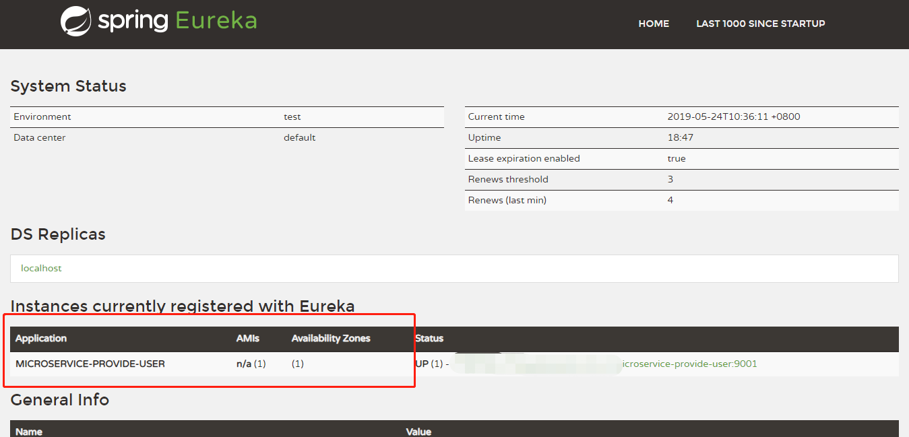
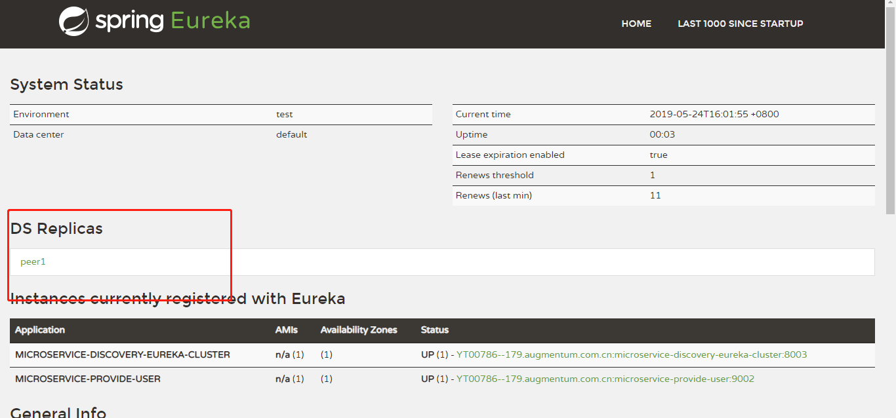

# spring cloud study
本次学习基于spring cloud Greenwich SR1 版本

## 学习要点: 

Spring Boot/Spring Cloud应用开发套路
* 加依赖
* 加注解
* 写配置

## Eureka (服务注册与发现)

Eureka是Netflix开源的服务发现组件，本身是一个基于REST的服务，包含Server和Client两部分，Spring Cloud将它集成在子项目Spring Cloud Netflix中

### Eureka Server (快速入门)
遵循开发套路

* 添加依赖
```xml
<dependencies>
    <dependency>
        <groupId>org.springframework.cloud</groupId>
        <artifactId>spring-cloud-starter-netflix-eureka-server</artifactId>
    </dependency>
</dependencies>

```
* 添加注解 @EnableEurekaServer
```java
@SpringBootApplication
@EnableEurekaServer 
public class EurekaApplication {

    public static void main(String[] args) {
        SpringApplication.run(EurekaApplication.class, args);
    }
}
```
```yml
server:
  port: 8001

spring:
  application:
    name: microservice-discovery-eureka

eureka:
  client:
    service-url:
      #erueka server的地址，记住/eureka不要掉了
      defaultZone: http://localhost:8001/eureka
    # 是否从eureka server注册，这里我们选择false
    fetch-registry: false
    # 是否从eureka server 中拉取服务
    register-with-eureka: false
```

启动项目,访问http://localhost:8001/


### Eureka Client 

```xml
<dependency>
    <groupId>org.springframework.cloud</groupId>
    <artifactId>spring-cloud-starter-netflix-eureka-client</artifactId>
</dependency>
``` 

```java
@SpringBootApplication
@EnableDiscoveryClient
public class ProvideApplication {

    public static void main(String[] args) {
        SpringApplication.run(ProvideApplication.class, args);
    }
}
```
在Greenwich SR1版本中可以省略@EnableEurekaClient和@EnableDiscoveryClient注解，但为了养成好习惯，建议加上相应注解

    @EnableDiscoveryClient: 可以配合不同的服务发现server 使用
    @EnableEurekaClient: 只能配合 Eureka server 使用

```yml
server:
  port: 9001
spring:
  application:
    name: microservice-provide-user
  datasource:
    driverClassName: com.mysql.jdbc.Driver
    url: jdbc:mysql://localhost:3306/cloud-study?useUnicode=true&characterEncoding=UTF-8&autoReconnect=true&useSSL=false&allowMultiQueries=true
    username: root
    password: root
    jpa:
      hibernate:
        ddl-auto: update
      show-sql: true


eureka:
  client:
    service-url:
      defaultZone: http://localhost:8001/eureka/
  instance:
   # 是否显示ip,如果不设置那么就会显示主机名，默认false
    prefer-ip-address: true
```
启动项目，可以发现项目已经被注册进eureka

 

 完整代码：

 [microservice-discovery-eureka](https://github.com/AmberBar/spring-cloud-study/tree/master/GreenwichSR1/microservice-discovery-eureka)

 [microservice-provide-user](https://github.com/AmberBar/spring-cloud-study/tree/master/GreenwichSR1/microservice-provide-user)

 ### eureka 深入

Eureka包含两个组件：Eureka Server 和 Eureka Client:

* Eureka Server负责提供服务发现的能力，各个微服务启动时，会向Eureka Server注册自己的信息（例如IP、端口、微服务名称等）
* Eureka Client是一个Java客户端，可以与EurekaServer交互
* client启动后，会周期性的像server发送心跳，默认情况下 `30s`,如果server在一定时间内没有收到client的心跳，那么server会注销实例`90s`
* Eureka Server遵循CAP原则，符合AP。eureka集群中每个节点之间都是平等状态。如果一个节点宕机，不会进行选举。因此可以很有效的保证可用性

#### 搭建erueka集群
在host中添加 
127.0.0.1 peer1 peer2
可以再`microservice-discovery-eureka` 的基础上修改`application.yml`

```yml
spring:
  application:
    name: microservice-discovery-eureka-cluster
eureka:
  client:
    serviceUrl:
      defaultZone: http://peer2:8002/eureka/,http://peer1:8003/eureka/
---
spring:
  profiles: peer1
server:
  port: 8002
eureka:
  instance:
    hostname: peer1
---
spring:
  profiles: peer2
server:
  port: 8003
eureka:
  instance:
    hostname: peer2
```
修改`microservice-provide-user`的`application.yml`
```yml
server:
  port: 9002
spring:
  application:
    name: microservice-provide-user
  datasource:
    driverClassName: com.mysql.jdbc.Driver
    url: jdbc:mysql://localhost:3306/cloud-study?useUnicode=true&characterEncoding=UTF-8&autoReconnect=true&useSSL=false&allowMultiQueries=true
    username: root
    password: root
    jpa:
      show-sql: true
eureka:
  client:
    service-url:
      defaultZone: http://peer1:8002/eureka/,http://peer2:8003/eureka/
  instance:
    prefer-ip-address: true

```

启动服务
 

## Ribbon 负载均衡器
Ribbon是Netflix提供的负载均衡器, 只需要为Ribbon提供服务提供者地址，Ribbon就会根据一定的算法调用相应服务，从而达到负载均衡，比如 随机，轮询等。

创建微服务 `microservice-consumer-ribbon`

* 添加依赖
因为`spring-cloud-starter-netflix-eureka-client`依赖已经包含了ribbon，因此这里只需要引入`spring-cloud-starter-netflix-eureka-client`
```xml
<dependency>
    <groupId>org.springframework.cloud</groupId>
    <artifactId>spring-cloud-starter-netflix-eureka-client</artifactId>
</dependency>
```
* 写注解

`RibbonApplication.java`
```java
@SpringBootApplication
@EnableDiscoveryClient
public class RibbonApplication {

    public static void main(String[] args) {
        SpringApplication.run(RibbonApplication.class, args);
    }
}

```

* 写配置
配置主要是把ribbon注册进eureka server中
```yml
server:
  port: 7001
spring:
  application:
    name: microservice-consumer-ribbon

eureka:
  client:
    service-url:
      defaultZone: http://peer1:8001/eureka/
```

通过以上步骤就可以把ribbon注册进eureka,其实和`microservice-provide-user`注册进eureka server的写法并没有什么差别。

Ribbon既然是负载均衡器，那么如何来实现呢？
Ribbon是作为客户端的负载均衡器

```java
@Configuration
public class RestTemplateConfig {

    @Bean
    @LoadBalanced
    public RestTemplate restTemplate() {
        return new RestTemplate();
    }
}

```
```java
@RestController
public class RibbonController {

    @Autowired
    RestTemplate restTemplate;

    @GetMapping("/users/{id}")
    public User findById(@PathVariable Long id) {
        User user = restTemplate.getForObject(
                "http://microservice-provider-user/users/{id}", User.class,id
        );
        return user; 
    }
}
```
microservice-provider-user 对应着`microservice-provider-user`(被调用方yml中的spring.application.name值)

修改`microservice-provider-user`的端口，同时启动两个`microservice-provider-user`服务
连续访问 `http://localhost:7001/users/2` 
观察两个`microservice-provider-user`服务的后台，可以很明确的看到`microservice-provider-user`两个服务被分表调用了一次。由此可知Ribbon算法默认是轮询


